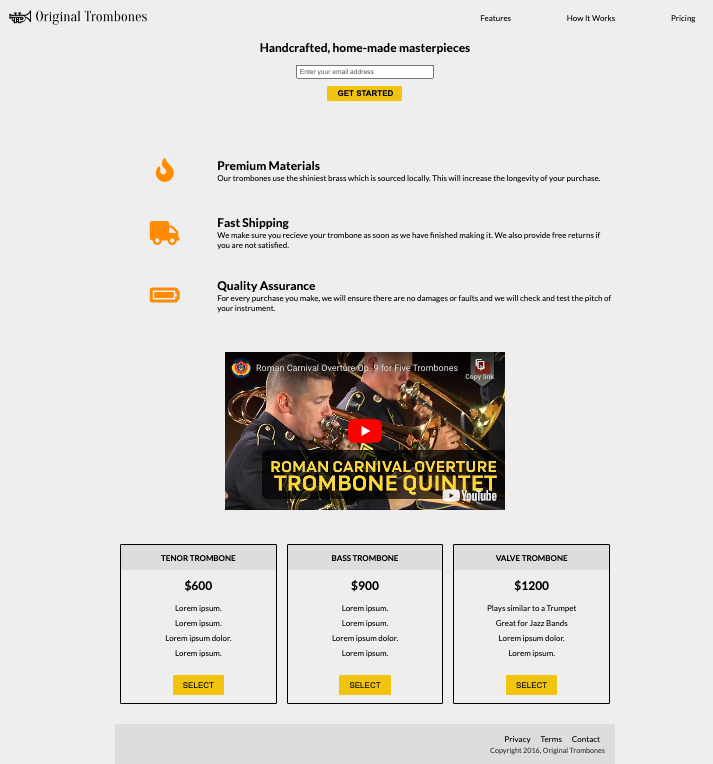
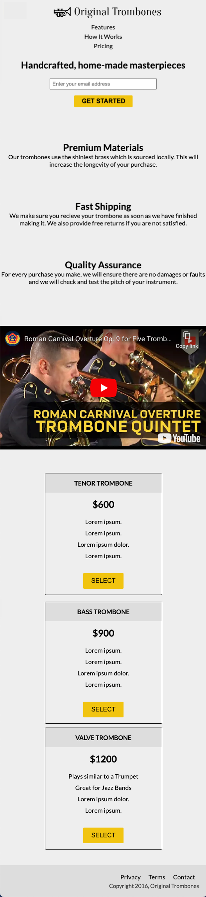

# 2.1.0 Lab: Product Landing Page
- [2.1.0 Lab: Product Landing Page](#210-lab-product-landing-page)
    - [Objective](#objective)
  - [Mockups or wire frames?](#mockups-or-wire-frames)
    - [Requirements](#requirements)
    - [Tips](#tips)
- [Submission](#submission)

### Objective
The objective of this project is to build a landing page for a product using the principles of _responsive design_. To complete this project, you will have to use CSS Flexbox and/or Grid along with media queries to create appropriate breakpoints to ensure that your landing page looks great on mobile *and* desktop browsers.

## Mockups or wire frames?
In [the first lab of this module](https://github.com/The-Marcy-Lab-School/2-0-2-lab_first-site), we used wire frames. This time we're going to use mockups. See below for the mockups:

Here is the desktop version of the site

Here is the mobile version of the site (notice there are no logos in the center)

### Requirements
You do not have to sell trombones of course, again, you can choose the topic! Here are some of the requirements you must have that may not be super clear with these mockups:
- The header is fixed to the top of the page on scroll
- The logo icons disappear when on mobile

Here are more specific requirements for each type of page. REMEMBER TO USE SEMANTIC ELEMENTS (header, nav, section, form, footer, main).

- Desktop Layout (if the screen width is greater than 720px):
  1. Header (fixed)
     * Logo
     * Navbar-style menu with three links **in a row**
       * nav is arial labelled 'primary'
  2. Email sign-up form
  3. Three product talking points **with font-awesome icons** and text right aligned on the page
  4. Embedded YouTube Video
  5. Three pricing cards **in a row**
  6. Footer with three links and a copyright
     - this nav is labelled 'footer'

- Mobile requirements (if the screen width is less than 720px)
  1. Header (fixed)
     * Logo image
     * Menu with three links stacked **in a column**
       * nav is arial labelled 'primary'
  2. Email sign-up form
  3. Three product talking points **centered on the page** with no icons.
  4. Embedded YouTube Video
  5. Three pricing cards advertising three different pricing points **in a column**
  6. Footer with three links and a copyright
     - this nav is labelled 'footer'

### Tips
* Experiment with the `position:sticky` property to achieve a header that stays in place when you scroll.
* The icons that you see in the desktop display are available for free at [Font Awesome](https://fontawesome.com/icons). These come in handy quite often so now is a good time to learn how to use them 😁.
* Your buttons on your card should respond when they are moused over. Explore the `:hover` psuedo-selector to achieve this effect.
* [YouTube videos are simple to embed](https://www.w3schools.com/html/html_youtube.asp). However, do not set `width` and `height` inline as they do in the live site. Use CSS to give your `<iframe>` a relative `width` (in percentages) and a `max-width`.
* The navbar links direct the user to different sections on the page (click on "Features", "How It Works", and "Pricing" to test it out). This can be done by assigning the different sections of your page an `id` and linking to that `id` in your anchor tag. More about that [here](https://learn.freecodecamp.org/responsive-web-design/basic-html-and-html5/link-to-internal-sections-of-a-page-with-anchor-elements/)

# Submission
Like last lab, make your own github repo and push up your code to that. Call it `2-1-0-lab_product-page-YOUR-NAME`. Then, submit the link to your instructor however they specified (probably on Canvas). Good luck and have fun! We hope you pick a cool product.